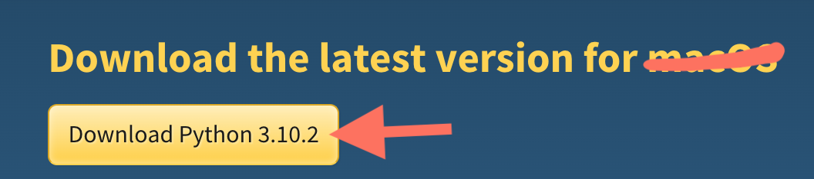

# Hands-on Python Foundations in 3 Weeks

This is the code for the *O'Reilly Live Training* - **Hands-on Python Foundations in 3 Weeks** presented by Arianne Dee

Before the class, please follow these instructions:

1. [Install Python](#1-install-python-36-or-higher)
2. [Install PyCharm](#2-download-pycharm-community-edition)
3. [Install Git](#3-install-git)
4. [Clone the code](#4-clone-the-course-repository)
5. [Make sure that you can run Python in PyCharm](#5-make-sure-that-you-can-run-python-in-pycharm)

## Set up instructions

### 1. Install Python

*Note:* some computers come with Python 2 preinstalled.
For this course, you'll need Python 3.6 or higher version (like 3.10).

Go to https://www.python.org/downloads/

**Mac/Linux**: Follow the prompts and install using the default settings.

**Windows**:

- You're installing Python now - [instructions](docs/WININSTALL.md)

- You've already installed Python - [instructions](docs/WINSETPATH.md)

### 2. Download PyCharm CE

Download the free, community edition
https://www.jetbrains.com/pycharm/download/

Install, open, and use the default settings.

### 3. Install Git

Follow your operating system instructions if you don't already have Git installed: 
[Git install instructions](https://git-scm.com/book/en/v2/Getting-Started-Installing-Git)

### 4. Clone the course repository 

Get the code for this course using Git.

**Option 1**

If you aren't familiar with Git, you can use PyCharm to clone a Git repository.

In PyCharm, when choosing which project to open, choose "Get from VCS" (clone from Git, which is a **v**ersion **c**ontrol **s**ystem)

[See full instructions](docs/PYCHARM_GIT_CLONE.md)

**Option 2**

If you know Git, clone the repository and then open the `python-foundations-3-weeks` folder in PyCharm.

### 5. Make sure that you can run Python in PyCharm

With the `python-foundations-3-weeks` folder open in Pycharm:

1. In the left panel, navigate to `examples/example_1_first_code.py` and double click to open it in the editor

2. On the open file, right click and select **Run 'example_1_first_code'**

3. In the Run tab on the bottom, you should see
   `Process finished with exit code 0`

4. Otherwise, if you got an error (exit code 1 in red), follow the instructions for setting your Python version in PyCharm below

### If you received an error running example_1_first_code, set your Python version in PyCharm

On a Mac:

- Go to **PyCharm** > **Preferences**

On a PC:

- Go to **File** > **Settings**

Once in Settings:

- Go to **Project: python-foundations-3-weeks** > **Project Interpreter**
- Look for your Python version in the Project Interpreter dropdown and select it. Please use Python 3.6 or higher.
- If you found it, click OK and try running `example_1_first_code` again
- Otherwise, if your version wasn't there, click **gear icon** > **Add...**
- In the new window, select **System Interpreter** on the left, and then look for the Python version in the dropdown
- If it's not there, click the **...** button and navigate to your Python location
- **Note:** For this last step, you may have to search the internet for where Python gets installed by default on your operating system

If you are having trouble configuring your Python version, you can find visual instructions
here: [Python interpreter setup](docs/PYCHARM_INTERPRETER.md)

## Outline and resources

Rough week-by-week outline with links to relevant interactive scenarios and pre-recorded video lessons.

**Interactive scenario list** - [Hands-On Python Foundations Scenarios](https://learning.oreilly.com/playlists/030e1bff-911b-4338-8e3b-4a0a0faa6783/)

**Video lesson 1** - [Introduction to Python](https://learning.oreilly.com/videos/introduction-to-python/9780135707333/)

**Video lesson 2** - [Next Level Python](https://learning.oreilly.com/videos/next-level-python/9780136904083/)

### Week 1

Getting started with Python

#### 1. Running Python

Run Python in interactive and script mode

[Interactive scenario 1](https://learning.oreilly.com/scenarios/hands-on-python-foundations/9780137904648X001/)
(steps 1 & 2)
/
[Video 1 lesson 1.2](https://learning.oreilly.com/videos/introduction-to-python/9780135707333/9780135707333-INPY_01_01_02/)
(0:00 - 2:00 and 12:00 - 13:45)

#### 2. Math

Using operators and importing the `math` module

[Interactive scenario 1](https://learning.oreilly.com/scenarios/hands-on-python-foundations/9780137904648X001/)
(steps 3 - 5)
/
[Video 1 lesson 2.1](https://learning.oreilly.com/videos/introduction-to-python/9780135707333/9780135707333-INPY_01_01_02/)
(2:00 - 12:00)

#### 3. Variables

Working with variables, naming rules and keywords

[Interactive scenario 2](https://learning.oreilly.com/scenarios/hands-on-python-foundations/9780137904648X002/)
(step 1)
/
[Video 1 lesson 2.2](https://learning.oreilly.com/videos/introduction-to-python/9780135707333/9780135707333-INPY_01_02_02/)

#### 4. Types

Basic data types, errors and type casting

[Interactive scenario 2](https://learning.oreilly.com/scenarios/hands-on-python-foundations/9780137904648X002/)
(steps 2 - 4)
/
[Video 1 lesson 2.1](https://learning.oreilly.com/videos/introduction-to-python/9780135707333/9780135707333-INPY_01_02_01/)
and
[Video 1 lesson 2.3](https://learning.oreilly.com/videos/introduction-to-python/9780135707333/9780135707333-INPY_01_02_03/)

#### 5. Text formatting

String concatination, formatting and interpolation

[Interactive scenario 2](https://learning.oreilly.com/scenarios/hands-on-python-foundations/9780137904648X002/)
(steps 5 & 6)
/
[Video 1 lesson 2.7](https://learning.oreilly.com/videos/introduction-to-python/9780135707333/9780135707333-INPY_01_02_07/)

#### 6. Functions

Defining your own functions

[Interactive scenario 3](https://learning.oreilly.com/scenarios/hands-on-python-foundations/9780137904648X003/)
(step 1)
/
[Video 1 lesson 2.6](https://learning.oreilly.com/videos/introduction-to-python/9780135707333/9780135707333-INPY_01_02_06/)

#### 7. Boolean expressions

True and false expressions, comparisons and methods

[Interactive scenario 3](https://learning.oreilly.com/scenarios/hands-on-python-foundations/9780137904648X003/)
(step 2)
/
[Video 1 lesson 3.2](https://learning.oreilly.com/videos/introduction-to-python/9780135707333/9780135707333-INPY_01_03_02/)

#### 8. Conditionals

If-elif-else statements

[Interactive scenario 3](https://learning.oreilly.com/scenarios/hands-on-python-foundations/9780137904648X003/)
(step 3)
/
[Video 1 lesson 3.3](https://learning.oreilly.com/videos/introduction-to-python/9780135707333/9780135707333-INPY_01_03_03/)

#### 9. Loops

While and for loops

[Interactive scenario 3](https://learning.oreilly.com/scenarios/hands-on-python-foundations/9780137904648X003/)
(step 4)
/
[Video 1 lesson 4.1 (while loops)](https://learning.oreilly.com/videos/introduction-to-python/9780135707333/9780135707333-INPY_01_04_01/)
and
[Video 1 lesson 4.4 (for loops)](https://learning.oreilly.com/videos/introduction-to-python/9780135707333/9780135707333-INPY_01_04_01/)

### Week 2

Writing simple scripts

#### 1. Lists

[Interactive scenario 4](https://learning.oreilly.com/scenarios/hands-on-python-foundations/9780137904648X004/)
(step 1)
/
[Video 1 lesson 4.3](https://learning.oreilly.com/videos/introduction-to-python/9780135707333/9780135707333-INPY_01_04_03/)

#### 2. Dictionaries

[Interactive scenario 4](https://learning.oreilly.com/scenarios/hands-on-python-foundations/9780137904648X004/)
(step 2)
/
[Video 2 lesson 1.3](https://learning.oreilly.com/videos/next-level-python/9780136904083/9780136904083-NLP1_01_01_03/)

#### 3. Tuples and sets

[Interactive scenario 4](https://learning.oreilly.com/scenarios/hands-on-python-foundations/9780137904648X004/)
(steps 3 & 4)
/
[Video 1 lesson 5.2](https://learning.oreilly.com/videos/introduction-to-python/9780135707333/9780135707333-INPY_01_05_02/)

#### 4. Exceptions

Catching and throwing errors/exceptions

[Interactive scenario 5](https://learning.oreilly.com/scenarios/hands-on-python-foundations/9780137904648X005/)
(steps 1 & 2)
/
[Video 2 lesson 1.4](https://learning.oreilly.com/videos/next-level-python/9780136904083/9780136904083-NLP1_01_01_04/)

#### 5. Files

Reading and writing to text files and CSV files

[Interactive scenario 5](https://learning.oreilly.com/scenarios/hands-on-python-foundations/9780137904648X005/)
(steps 3 - 5)
/
[Video 2 lesson 2](https://learning.oreilly.com/videos/next-level-python/9780136904083/9780136904083-NLP1_01_02_00/)
(lessons 2.1 - 2.3)

#### 6. HTTP requests

Making GET and POST requests using the `requests` library

[Interactive scenario 5](https://learning.oreilly.com/scenarios/hands-on-python-foundations/9780137904648X005/)
(steps 1 & 4)
/
[Video 2 lesson 7.1](https://learning.oreilly.com/videos/next-level-python/9780136904083/9780136904083-NLP1_01_07_01/)

#### 7. APIs

Getting data from APIs

[Interactive scenario 5](https://learning.oreilly.com/scenarios/hands-on-python-foundations/9780137904648X005/)
(steps 2, 3 & 5)
/
[Video 2 lesson 7.5](https://learning.oreilly.com/videos/next-level-python/9780136904083/9780136904083-NLP1_01_07_05/)

#### 8. Command line overview

No interactive scenario
/
[Video 2 lesson 3.1](https://learning.oreilly.com/videos/next-level-python/9780136904083/9780136904083-NLP1_01_03_01/)

#### 9. Script arguments

No interactive scenario or video lesson

Code examples in 
`examples/week_2/example_23_args.py` and
`examples/week_2/example_24_click.py`

### Week 3

Working with real-world applications

*Todo*

## FAQs

### Can I use Python 2?

No, Python 2 is out of date. Please download a version that is at least Python 3.6.

### Can I use a different code editor besides PyCharm?

Yes, but it is only recommended if you are already know it and are comfortable navigating to different files and running commands in the command line.
If it has syntax highlighting for Python, that is ideal.

If you are using VS Code, make sure the Python plugin is installed.

### PyCharm can't find Python 3

Follow the instructions for [Python interpreter setup](docs/PyCharm_interpreter.md)
