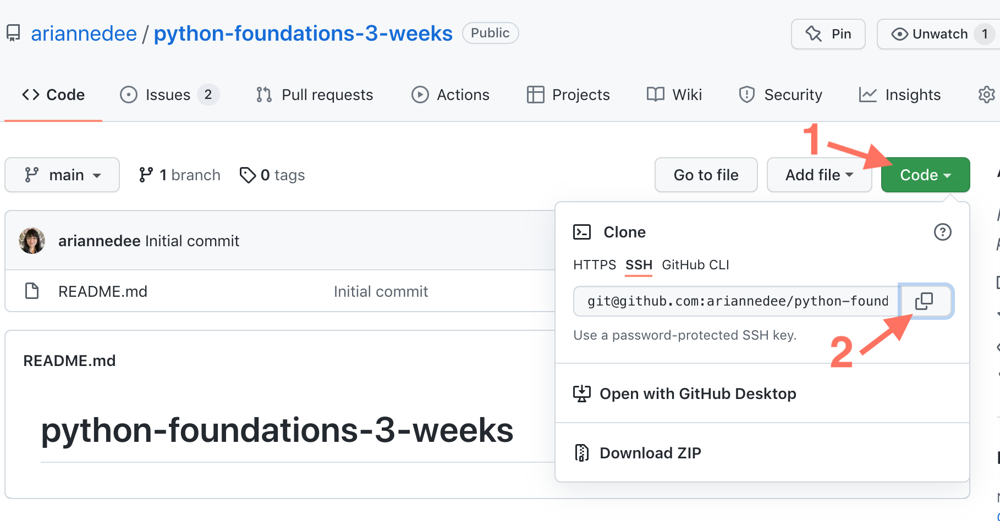
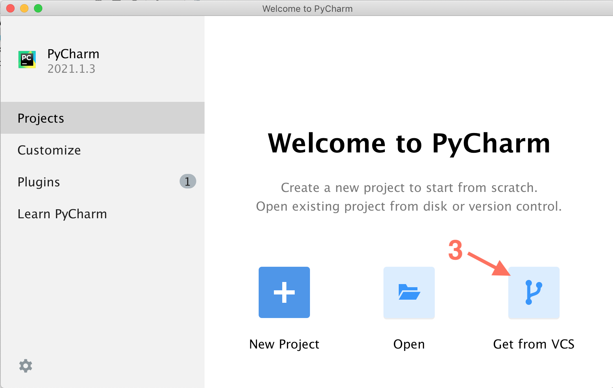
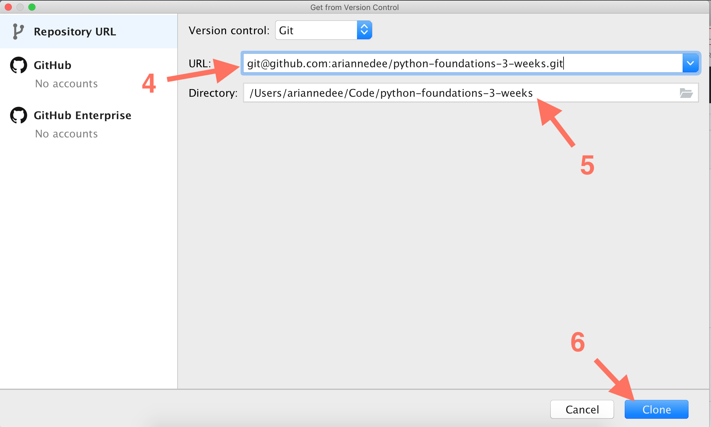

# Clone from GitHub using PyCharm 

1. On the [main GitHub page](https://github.com/ariannedee/python-foundations-3-weeks/), click the green **Code** button

2. Copy the repository's SSH url

   
3. When you open PyCharm, choose the **Get from VCS** option (VCS stands for version control system, like Git)

   
4. Paste the repository's SSH url
5. Choose a directory to put the code into
6. **Clone** it!

   
