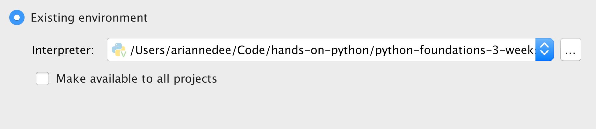
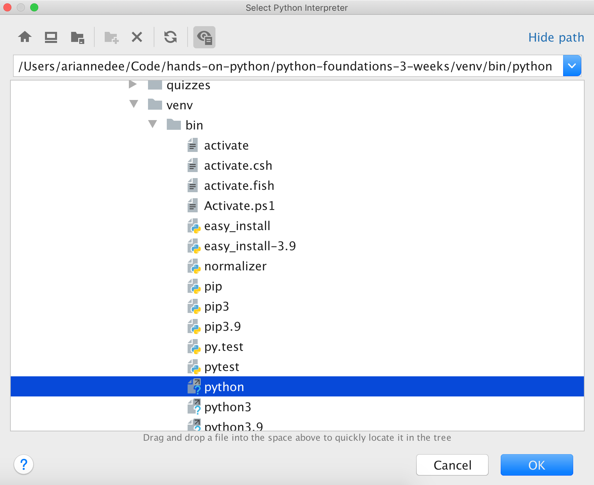

# Virtual environments PyCharm

## 1. Open your settings/preferences

   
   
## 2. Navigate to the Project Interpreter

   
   
## 3. Virtual environment should be selected on the left

   

## 4a. Select an existing interpreter

   
   
PyCharm may have found your `venv` folder automatically.
If so, click OK.

## 4b. Choose your `venv` interpreter

   
   
Click on `...` and navigate to your project folder > venv > bin/Scripts > python/python.exe and click OK.
